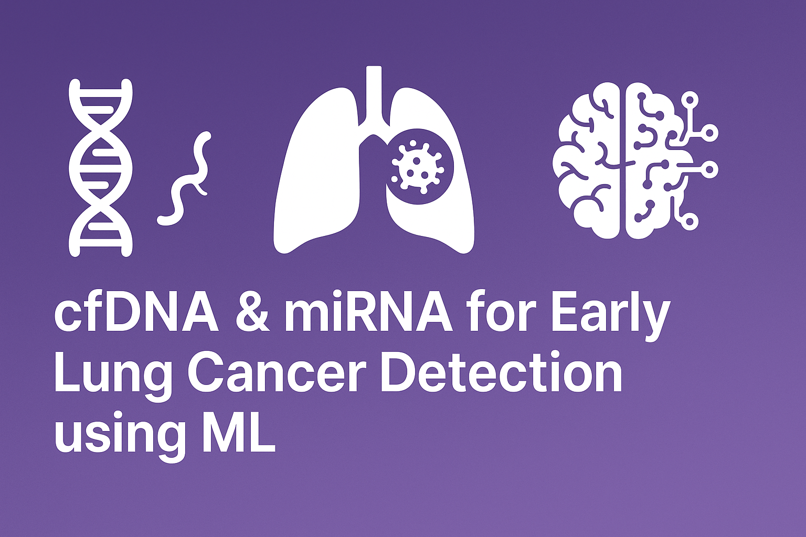

[](https://cfDNA-miRNA-lungcancer.streamlit.app/)


### Integrative Analysis of cfDNA Methylation and miRNA Expression for Early Lung Cancer Detection Using Machine Learning
# Overview
This project focuses on the early detection of lung cancer using an integrated analysis of two powerful non-invasive biomarkers:

Cell-free DNA (cfDNA) methylation profiles

# miRNA expression data

We built and evaluated multiple machine learning models to classify lung cancer vs normal samples, highlighting key biomarkers and achieving strong predictive performance. This project is suitable for clinical research, diagnostic development, and bioinformatics applications.
## Project Structure
cfDNA_LungCancer_ML/
│
├── data/
│   ├── raw/
│   └── processed/
│
├── notebooks/
│   ├── 1_Data_Preprocessing.ipynb
│   ├── 2_Data_Integration_and_Labeling.ipynb
│   ├── 3_Model_Training_and_Evaluation.ipynb
│   ├── 4_Model_Evaluation_and_Visualization.ipynb
│   ├── 5_Model_Inference_and_Usage.ipynb
│   └── 6_Research_Report_and_Literature_Review.ipynb
│
├── results/
│   └── plots/
│
├── models/
├── streamlit_app/
│   └── app.py
│
├── requirements.txt
└── README.md

## Objectives

1. Integrate cfDNA methylation & miRNA expression data.

2. Train classification models for early lung cancer detection.

3. Identify top biomarkers using model interpretability.

4. Visualize model performance (ROC, confusion matrix).

5. Deploy prediction interface using Streamlit.

## Technologies Used

1. Python (NumPy, Pandas, Matplotlib, Seaborn)

2. Machine Learning (Scikit-learn, XGBoost)

3. Bioinformatics concepts (cfDNA, miRNA biomarker profiling)

4. Deployment: Streamlit

5. Model Persistence: joblib

6. Data Source: TCGA-LUAD datasets

## Models Trained

1. Logistic Regression

2. Random Forest Classifier

3. Support Vector Machine (SVM)

## Evaluation Metrics

1. Accuracy

2. Precision, Recall, F1-Score

3. Confusion Matrix

4. ROC-AUC Curve

## Key Results

| Model               | Accuracy | AUC Score |
| ------------------- | -------- | --------- |
| Logistic Regression | \~72%    | 0.81      |
| Random Forest       | \~75%    | 0.84      |
| SVM (RBF Kernel)    | \~73%    | 0.82      |

Random Forest highlighted top 20 important integrated features. All models showed balanced performance

## How to Run the Project

1. Install dependencies:
pip install -r requirements.txt

2. Run Jupyter Notebooks:

. 1_Data_Preprocessing.ipynb
. 2_Data_Integration_and_Labeling.ipynb
. 3_Model_Training_and_Evaluation.ipynb
. 4_Model_Evaluation_and_Visualization.ipynb
. 5_Model_Inference_and_Usage.ipynb

3. Launch Streamlit app:
 cd streamlit_app
 streamlit run app.py

4. Sample Input for Prediction
The app accepts scaled cfDNA and miRNA expression values and classifies the input as:

-> Normal

-> Lung Cancer

5.  **Live Demo**: [Click here to view the deployed app](https://cfDNA-miRNA-lungcancer.streamlit.app/)


## References
 
1. TCGA-LUAD: The Cancer Genome Atlas – Lung Adenocarcinoma

2. GEO Datasets for cfDNA methylation and miRNA

3. Latest studies on non-invasive biomarkers in cancer detection

## Maintainer
Sanjai C.
MS Bioiformatics & Immunobiology
Amrita School of Boitechnology, Amrita Vishwa Vidyapeetham
University of Arizona

Email: sanjaichippukutty@gmail.com
##  Citation


```bibtex
@misc{chippukutty2025cfDNAmiRNA,
  author       = {Sanjai Chippukutty},
  title        = {Integrative Analysis of cfDNA Methylation and miRNA Expression for Early Cancer Detection Using Machine Learning},
  year         = {2025},
  url          = {https://github.com/Sanjai-Chippukutty/cfDNA-Lung-Cancer-ML},
  note         = {GitHub repository}
}


# cfDNA-Lung-Cancer-ML
Integrative analysis of cfDNA methylation and miRNA expression for early lung cancer detection using machine learning.

